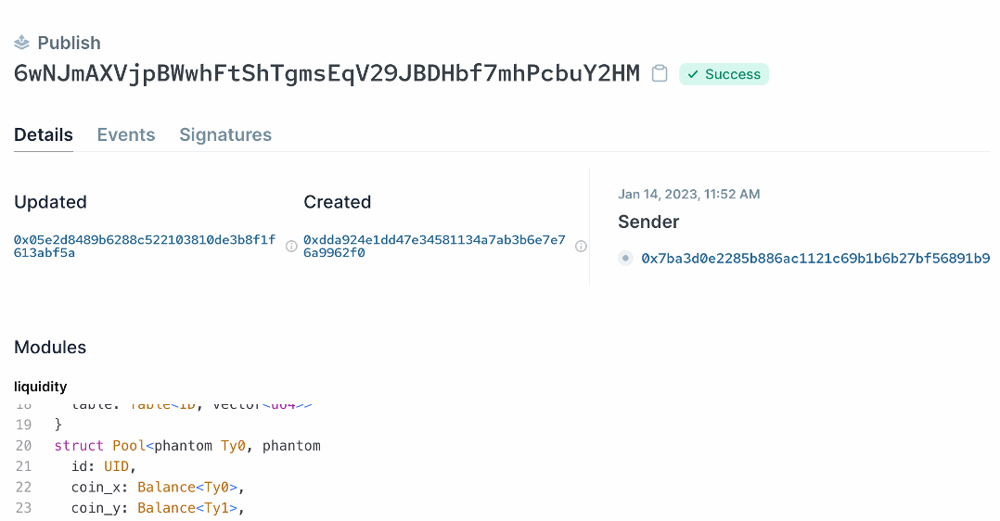
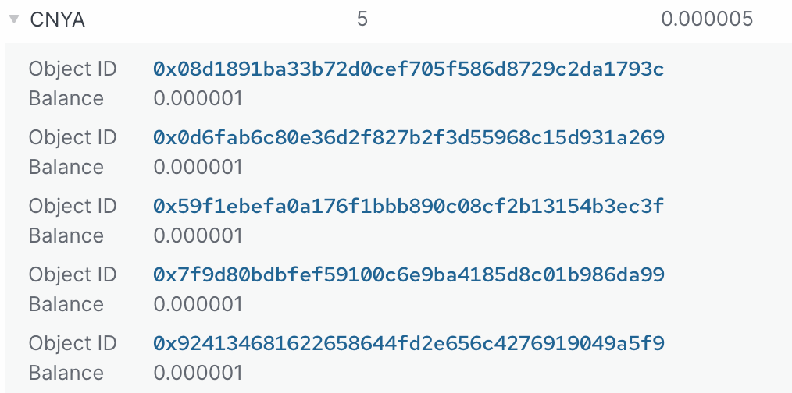
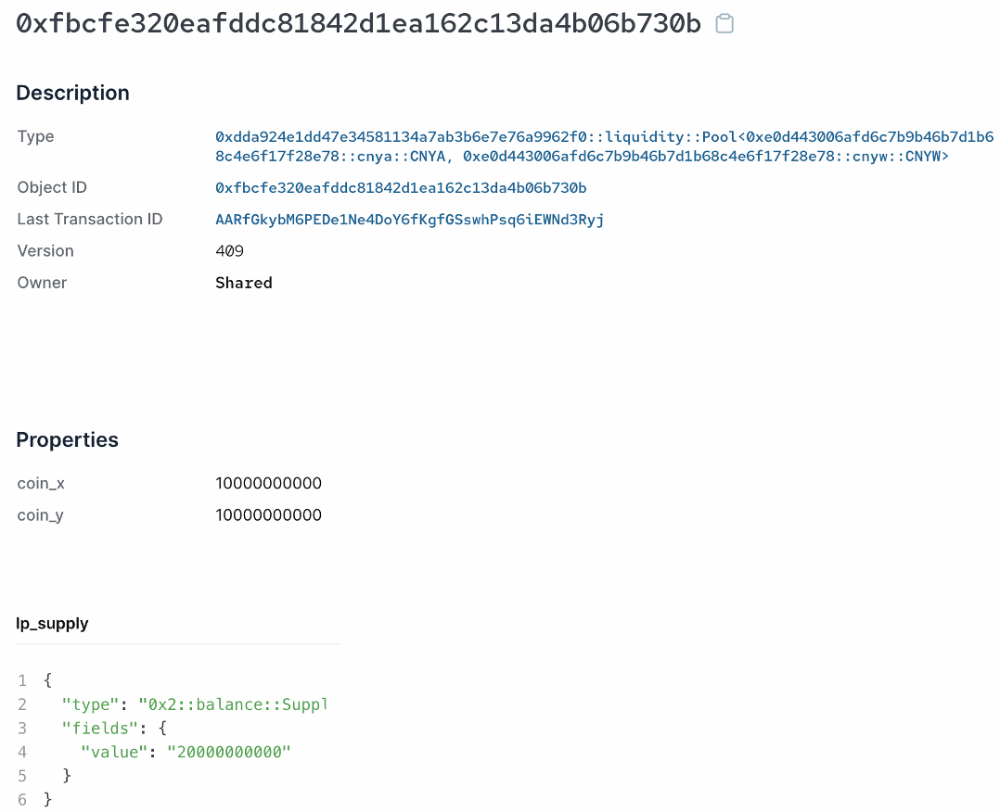
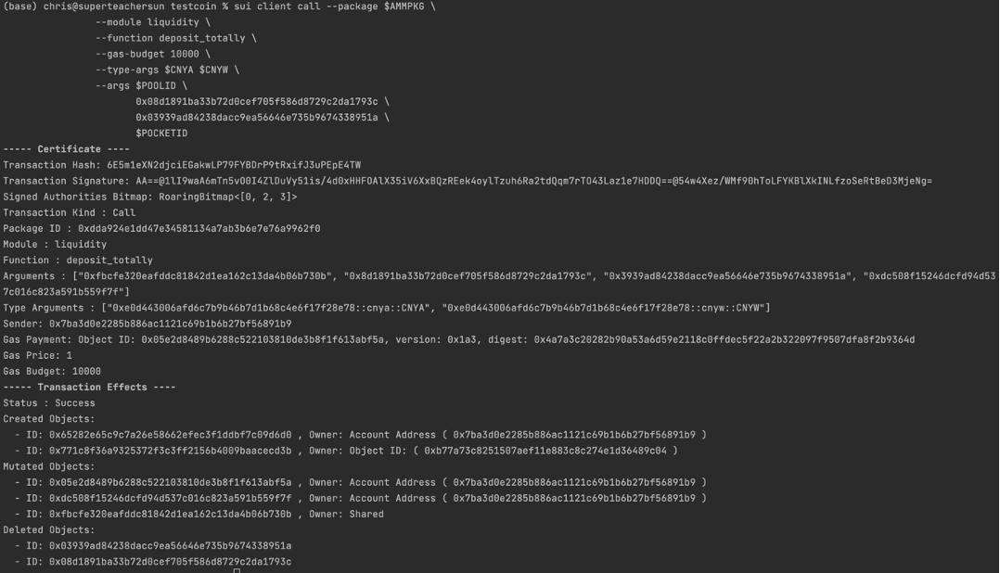
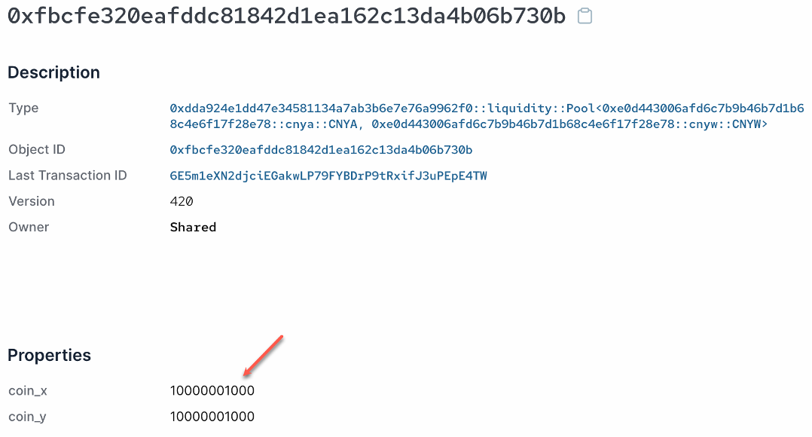
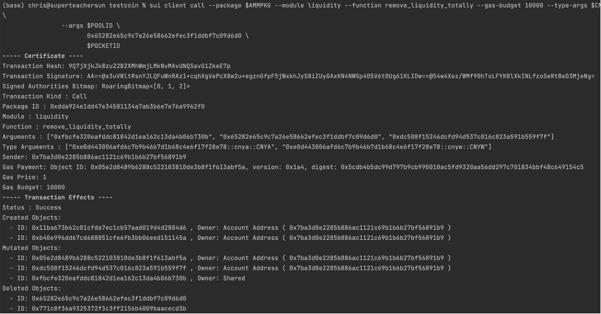
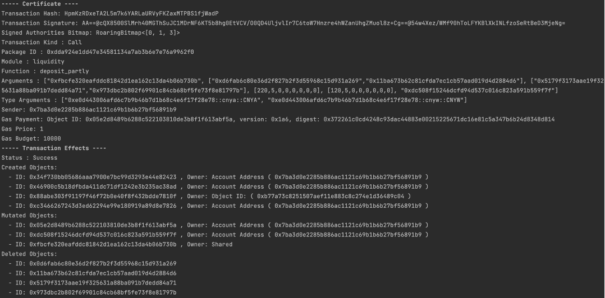
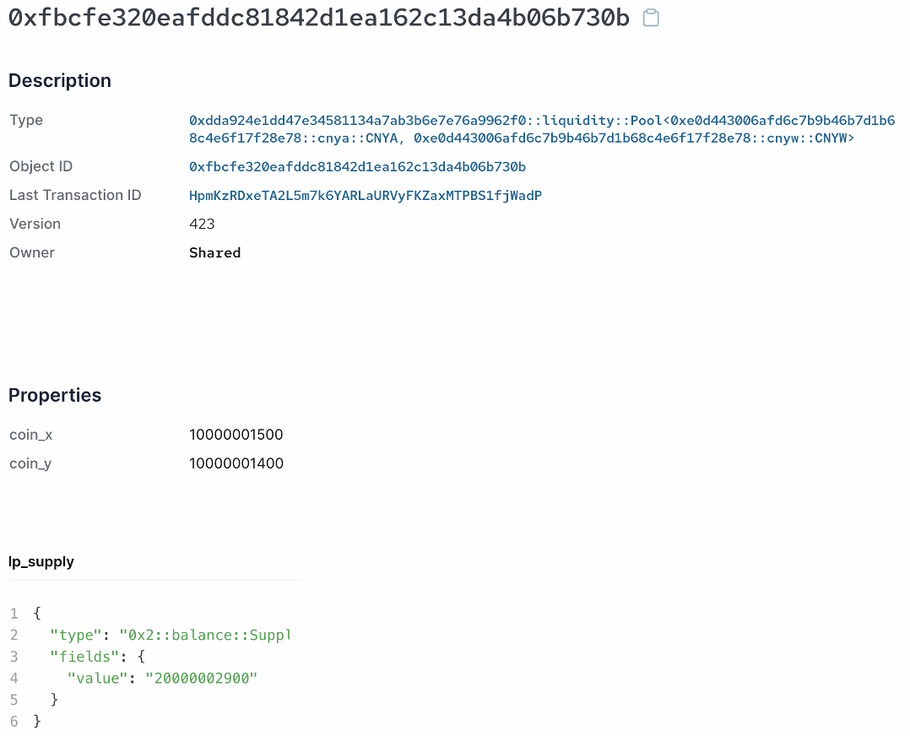
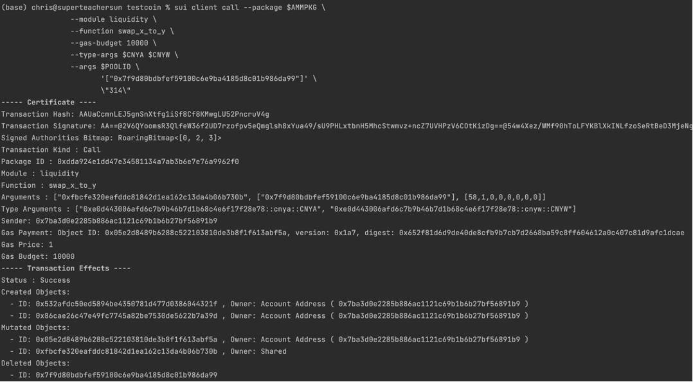
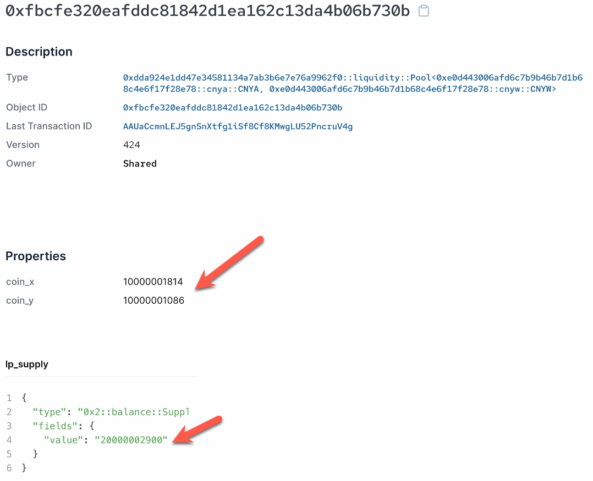

# Simple swap module in sui

合约liquidity实现了一个在sui公链上的 DEX模式的swap案例，它仅仅实现了以下几种功能：

  - 创建交换流动池 [Pool]()
  - 添加流动性
  - 提供流动交易对 [LP]()
  - 移除流动性，包括部分移除和全部移除
  - 两种 [Coin]() 之间的交换

默认在此案例中交互的两种 [Coin]() 交换汇率为1：1，在其中没有设置交易手续费，也没考虑其中一种 [Coin]() 的增加或减少所带来的流动损失。

## 0x1合约结构

```rust
/// simple swap module in sui
module swap::liquidity{
    // packages: 包

    // structs: 结构体

    // consts: 常量
    
    // functions: 函数
}
```

## 0x2 liquidity的结构体

包含 [LP](), [Pool](), [Pocket]() 三个结构体：

```rust
///Liquidity provider, parameter 'X' and 'Y'
///are coins held in the pool.
struct LP<phantom X, phantom Y> has drop {}

/// Pool with exchange
struct Pool<phantom X, phantom Y> has key {
    id: UID,
    coin_x: Balance<X>,
    coin_y: Balance<Y>,
    lp_supply: Supply<LP<X, Y>>
}

///pocket to keep the Liquidity provider
///and balance of Coin X/Y
struct Pocket has key {
    id: UID,
    table: Table<ID, vector<u64>>
}
```
  - [LP]()是流动交易对，可以当成流水凭证，用以保存 X/Y 两种 [Coin]()加入流动性时的总数额。
  - [Pool]() 是交易流动池，由AMM创建用以保存 X/Y 两种 [Coin]() 以及总的储备。
  - [Pocket]() 由交易方创建，用以存储每一笔流水中，X/Y 两种 [Coin]() 的存入流动池中的数额。

### 2.1 Supply

>https://github.com/MystenLabs/sui/blob/aa5fe5bf68b20cc2def0392cbab71f8bcdad0060/crates/sui-framework/sources/balance.move#L19

定义sui中 [token]() 的供应量，该结构体点个具备 [store]() 能力，可以作为其它 struct字段存储。

### 2.2 Table

>https://github.com/MystenLabs/sui/blob/aa5fe5bf68b20cc2def0392cbab71f8bcdad0060/crates/sui-framework/sources/table.move#L28

[Table]() 是 sui 中提供的一个容器，在标注类型时，要明确其中的键 [K]()和值 [V]()的类型。

## 0x3函数

### 3.1 创建交换流动池

```rust
///create a new pool
public fun new_pool<X, Y>(ctx: &mut TxContext) {
    let new_pool = Pool<X, Y> {
        id: object::new(ctx),
        coin_x: balance::zero(), 
        coin_y: balance::zero(), 
        lp_supply: balance::create_supply<LP<X, Y>>(LP {}) 
        };
    transfer::share_object(new_pool);
}

///entry function to generate new pool
public entry fun generate_pool<X, Y>(ctx: &mut TxContext) {
    new_pool<X, Y>(ctx);  
}
```

#### 3.1.1 balance::zero函数

>https://github.com/MystenLabs/sui/blob/aa5fe5bf68b20cc2def0392cbab71f8bcdad0060/crates/sui-framework/sources/balance.move#L61

初始化一个[Coin]()的余额，价值为0。

#### 3.1.2 balance::create_supply函数

>https://github.com/MystenLabs/sui/blob/aa5fe5bf68b20cc2def0392cbab71f8bcdad0060/crates/sui-framework/sources/balance.move#L41

初始化一个 [Coin]()的供应量，价值为0。

#### 3.1.3 new_pool 和 genenrate_pool 做了什么？

加上注释:
```rust
///create a new pool
public fun new_pool<X, Y>(ctx: &mut TxContext) {
    // 构造新的Pool
    let new_pool = Pool<X, Y> {
        id: object::new(ctx),
        coin_x: balance::zero(), // 初始化Coin X余额，数量0
        coin_y: balance::zero(), // 初始化Coin Y余额，数量0
        lp_supply: balance::create_supply<LP<X, Y>>(LP {}) // 初始化供应量，0余额
    };
    // 共享新构造的交易流动池
    transfer::share_object(new_pool);
    }

///entry function to generate new pool
public entry fun generate_pool<X, Y>(ctx: &mut TxContext) {
    new_pool<X, Y>(ctx);  // 调用new_pool函数创建新的交易流动池
}
```

### 3.2 新建凭证钱包函数

```rust
///entry function to create new pocket
public entry fun create_pocket(ctx: &mut TxContext) {
    // 构造新的 Pocket
    let pocket = Pocket {
        id: object::new(ctx),
        table: table::new<ID, vector<u64>>(ctx) //初始化table 容器，存储 Coin X/Y在流水凭证中的数额
    };
    // 将新的 Pocket transer 给交易发送人
    transfer::transfer(pocket, sender(ctx));
}
```

#### 3.2.1 table::new 函数

>https://github.com/MystenLabs/sui/blob/aa5fe5bf68b20cc2def0392cbab71f8bcdad0060/crates/sui-framework/sources/table.move#L35

初始化 [table]()容器。

### 3.3 添加流动性函数

1. add_liquidity是一个 public函数，实现了加入流动性的基本功能
2. deposit_totally：entry函数，将参数中两种 Coin余额全部加入流动池中
3. deposit_partly：entry函数，合并多个 Coin obj,并将一定数量的余额加入流动池。

```rust
///Add liquidity into pool, exchange rate is 1 between X and Y
public fun add_liquidity<X, Y>(pool: &mut Pool<X, Y>,
                                coin_x: Coin<X>,
                                coin_y: Coin<Y>,
                                ctx: &mut TxContext): (Coin<LP<X, Y>>, vector<u64>) {
    let coin_x_value = coin::value(&coin_x);
    let coin_y_value = coin::value(&coin_y);
    assert!(coin_x_value > 0 && coin_y_value > 0, ErrZeroAmount);
    coin::put(&mut pool.coin_x, coin_x);
    coin::put(&mut pool.coin_y, coin_y);
    let lp_bal = balance::increase_supply(&mut pool.lp_supply, coin_x_value + coin_y_value);
    let vec_value = vector::empty<u64>();
    vector::push_back(&mut vec_value, coin_x_value);
    vector::push_back(&mut vec_value, coin_y_value);
    (coin::from_balance(lp_bal, ctx), vec_value)
}
```

```rust
///entry function to deposit total Coin X and Y to pool
public entry fun deposit_totally<X, Y>(pool: &mut Pool<X, Y>,
                                    coin_x: Coin<X>,
                                    coin_y: Coin<Y>,
                                    pocket: &mut Pocket,
                                    ctx: &mut TxContext) {
    let (lp, vec) = add_liquidity(pool, coin_x, coin_y, ctx);
    let lp_id = object::id(&lp);
    table::add(&mut pocket.table, lp_id, vec);
    transfer::transfer(lp, sender(ctx));
}
```

```rust
///entry function to deposit part of Coin X and Y to pool
public entry fun deposit_partly<X, Y>(pool: &mut Pool<X, Y>,
                                        coin_x_vec: vector<Coin<X>>,
                                        coin_y_vec: vector<Coin<Y>>,
                                        coin_x_amt: u64,
                                        coin_y_amt: u64,
                                        pocket: &mut Pocket,
                                        ctx: &mut TxContext) {
    let coin_x_new = coin::zero<X>(ctx);
    let coin_y_new = coin::zero<Y>(ctx);
    pay::join_vec(&mut coin_x_new, coin_x_vec);
    pay::join_vec(&mut coin_y_new, coin_y_vec);
    let coin_x_in = coin::split(&mut coin_x_new, coin_x_amt, ctx);
    let coin_y_in = coin::split(&mut coin_y_new, coin_y_amt, ctx);
    let (lp, vec) = add_liquidity(pool, coin_x_in, coin_y_in, ctx);
    let lp_id = object::id(&lp);
    table::add(&mut pocket.table, lp_id, vec);
    transfer::transfer(lp, sender(ctx));
    let sender_address = sender(ctx);
    transfer::transfer(coin_x_new, sender_address);
    transfer::transfer(coin_y_new, sender_address);
}
```

#### 3.3.1 coin::value函数

>https://github.com/MystenLabs/sui/blob/aa5fe5bf68b20cc2def0392cbab71f8bcdad0060/crates/sui-framework/sources/coin.move#L102

获取一枚 [Coin]()中的价值[value]()。

#### 3.3.2 coin::put 函数

>https://github.com/MystenLabs/sui/blob/aa5fe5bf68b20cc2def0392cbab71f8bcdad0060/crates/sui-framework/sources/coin.move#L149

将一枚 [Coin]()的价值增加到另一个 [Balance]() [Obj]() 中，然后销毁这枚 [Coin]()。

#### 3.3.3 coin::split函数

>https://github.com/MystenLabs/sui/blob/aa5fe5bf68b20cc2def0392cbab71f8bcdad0060/crates/sui-framework/sources/coin.move#L180

从一枚 [Coin]()中分出价值为 [split_amount]() 的余额，并用这个数量的余额构造一枚新的 [Coin]()。

#### 3.3.4 balance::increase_supply函数

>https://github.com/MystenLabs/sui/blob/aa5fe5bf68b20cc2def0392cbab71f8bcdad0060/crates/sui-framework/sources/balance.move#L46

增加一种 [Coin]()的供应数量，增量为 [value]()，并返回价值为 [value]()的 [Balance]()。Supply 中的字段 [value]()是 u64类型，所以在增加供应量时，需要注意不要超过 u64的最大值，即[18446744073709551615u64]()。

#### 3.3.5 object::id 函数

>https://github.com/MystenLabs/sui/blob/aa5fe5bf68b20cc2def0392cbab71f8bcdad0060/crates/sui-framework/sources/object.move#L117

获取一个 [obj]() 的 [ID]()。

#### 3.3.6 table::add函数

>https://github.com/MystenLabs/sui/blob/aa5fe5bf68b20cc2def0392cbab71f8bcdad0060/crates/sui-framework/sources/table.move#L43

将一对键 [K]()和值 [V]()添加到 容器table内。

#### 3.3.7 pay::join_vec函数

>https://github.com/MystenLabs/sui/blob/aa5fe5bf68b20cc2def0392cbab71f8bcdad0060/crates/sui-framework/sources/pay.move#L67

将一组存储在向量中的 [coins]()的余额全部合并到另一个 [Coin]()中，同时销毁这组 [coins]()。
<br/>
在调用这个函数时，给 coins 传值需要用到格式：
 
```shell
'["coin1","coin2","coin3",...]'
```

#### 3.3.8 添加流动性的三个函数分别做了什么？

加上注释

```rust
///Add liquidity into pool, exchange rate is 1 between X and Y
public fun add_liquidity<X, Y>(pool: &mut Pool<X, Y>,
                                coin_x: Coin<X>,
                                coin_y: Coin<Y>,
                                ctx: &mut TxContext): (Coin<LP<X, Y>>, vector<u64>) {
    let coin_x_value = coin::value(&coin_x);//获取 Coin X中的数额
    let coin_y_value = coin::value(&coin_y);//获取 Coin Y中的数额
    assert!(coin_x_value > 0 && coin_y_value > 0, ErrZeroAmount);
    coin::put(&mut pool.coin_x, coin_x); //将 Coin X 的数额回到流动池中 X 的余额中，并销毁X
    coin::put(&mut pool.coin_y, coin_y); //将 Coin Y 的数额回到流动池中 Y 的余额中，并销毁Y
    // 增加流动池中总的供应量，增量为上面被销毁的 Coin X和 Coin Y的数额总和，X和Y 的 exchange rate 为1：1
    let lp_bal = balance::increase_supply(&mut pool.lp_supply, coin_x_value + coin_y_value);
    let vec_value = vector::empty<u64>();
    vector::push_back(&mut vec_value, coin_x_value);
    vector::push_back(&mut vec_value, coin_y_value);
    // 返回 Coin LP 和 存储Coin X/Y数额的向量
    (coin::from_balance(lp_bal, ctx), vec_value)
}
```

```rust
///entry function to deposit total Coin X and Y to pool
public entry fun deposit_totally<X, Y>(pool: &mut Pool<X, Y>,
                                        coin_x: Coin<X>,
                                        coin_y: Coin<Y>,
                                        pocket: &mut Pocket,
                                        ctx: &mut TxContext) {
    // 调用add_liquidity函数
    let (lp, vec) = add_liquidity(pool, coin_x, coin_y, ctx);
    // 获取返回的 LP 的 ID
    let lp_id = object::id(&lp);
    // 将LP ID 和返回的向量加到容器中
    table::add(&mut pocket.table, lp_id, vec);
    // 传输流水凭证给发送人
    transfer::transfer(lp, sender(ctx));
}
```

```rust
///entry function to deposit part of Coin X and Y to pool
public entry fun deposit_partly<X, Y>(pool: &mut Pool<X, Y>,
                                        coin_x_vec: vector<Coin<X>>,
                                        coin_y_vec: vector<Coin<Y>>,
                                        coin_x_amt: u64,
                                        coin_y_amt: u64,
                                        pocket: &mut Pocket,
                                        ctx: &mut TxContext) {
    let coin_x_new = coin::zero<X>(ctx);// 构造0数额的Coin X
    let coin_y_new = coin::zero<Y>(ctx);// 构造0数额的Coin Y
    // 将向量中的一组 Coin X/Y加入到新构造的 Coin X/Y中
    pay::join_vec(&mut coin_x_new, coin_x_vec);
    pay::join_vec(&mut coin_y_new, coin_y_vec);
    // 从整合好的Coin X/Y中分离一枚数额为 coin_x_amt/coin_y_amt 的新Coin
    let coin_x_in = coin::split(&mut coin_x_new, coin_x_amt, ctx);
    let coin_y_in = coin::split(&mut coin_y_new, coin_y_amt, ctx);
    // 调用add_liquidity 函数
    let (lp, vec) = add_liquidity(pool, coin_x_in, coin_y_in, ctx);
    let lp_id = object::id(&lp);
    table::add(&mut pocket.table, lp_id, vec);
    transfer::transfer(lp, sender(ctx));
    let sender_address = sender(ctx);
    // 分离出coin_x_amt/coin_y_amt 数额之后，将有剩余数额的 Coin X/Y传输给发送人
    transfer::transfer(coin_x_new, sender_address);
    transfer::transfer(coin_y_new, sender_address);
}
```

### 3.4 移除流动性函数

```rust
///Remove the liquidity and balance from pool
public fun remove_liquidity<X, Y>(pool: &mut Pool<X, Y>,
                                    lp: Coin<LP<X, Y>>,
                                    vec: vector<u64>,
                                    ctx: &mut TxContext): (Coin<X>, Coin<Y>) {
    assert!(vector::length(&vec) == 2, ErrInvalidVecotrType);
    let lp_balance_value = coin::value(&lp); // 获取流水凭证中的数额
    let coin_x_out = *vector::borrow(&mut vec, 0);// 获取流水凭证中 Coin X的数额
    let coin_y_out = *vector::borrow(&mut vec, 1);// 获取流水凭证中 Coin Y的数额
    assert!(lp_balance_value == coin_x_out + coin_y_out, ErrBalanceNotMatch);
    assert!(balance::value(&mut pool.coin_x) > coin_x_out, ErrNotEnoughXInPool);
    assert!(balance::value(&mut pool.coin_y) > coin_y_out, ErrNotEnoughYInPool);
    // 缩减供应
    balance::decrease_supply(&mut pool.lp_supply, coin::into_balance(lp));
    // 返回从流动池余额中移除的Coin X/Y
    (
        coin::take(&mut pool.coin_x, coin_x_out, ctx),
        coin::take(&mut pool.coin_y, coin_y_out, ctx)
    )
}
```

```rust
///entry function Withdraw all balance in Liquidity provider from pool
public entry fun remove_liquidity_totally<X, Y>(pool: &mut Pool<X, Y>,
                                                lp: Coin<LP<X, Y>>,
                                                pocket: &mut Pocket,
                                                ctx: &mut TxContext) {
    let lp_id = object::id(&lp); // 获取LP 的 ID
    // 从钱包中获取存有 Coin X/Y数额的向量容器
    let vec = *table::borrow(&mut pocket.table, lp_id);
    // 调用remove_liquidity 函数
    let (coin_x_out, coin_y_out) = remove_liquidity(pool, lp, vec, ctx);
    assert!(coin::value(&coin_x_out) > 0 && coin::value(&coin_y_out) > 0, ErrRemoveFailed);
    // 从钱包中移除存有 Coin X/Y数额的向量容器
    let vec_out = table::remove(&mut pocket.table, lp_id);
    vector::remove(&mut vec_out, 0);
    vector::remove(&mut vec_out, 0);
    let sender_address = sender(ctx);
    // 将流动池资产中获得的 Coin X/Y 传输给发送人
    transfer::transfer(coin_x_out, sender_address);
    transfer::transfer(coin_y_out, sender_address);
}
```

#### 3.4.1 balance::decreate_supply函数

>https://github.com/MystenLabs/sui/blob/aa5fe5bf68b20cc2def0392cbab71f8bcdad0060/crates/sui-framework/sources/balance.move#L53

缩减 [Coin]()的供应量。

### 3.5 Coin swap 函数

Swap可以理解成拿着现金去银行兑换货币，交易方用 Coin X兑换 Coin Y之后，流水池中Coin X的余额将会增加，而Coin Y的余额会减少；反之亦然。

```rust
///swap Coin X to Y, return Coin Y
public fun swap_x_outto_y<X, Y>(pool: &mut Pool<X, Y>,
                                paid_in: Coin<X>,
                                ctx: &mut TxContext): Coin<Y> {
    let paid_value = coin::value(&paid_in);// 获取 Coin X的数额
    coin::put(&mut pool.coin_x, paid_in); // 将 Coin X的数额增加到流动池中，并销毁这枚 coin
    assert!(paid_value < balance::value(&mut pool.coin_y), ErrNotEnoughYInPool);
    coin::take(&mut pool.coin_y, paid_value, ctx)// 从流动池中获取 Coin Y并返回
}

public entry fun swap_x_to_y<X, Y>(pool: &mut Pool<X, Y>,
                                    coin_x_vec: vector<Coin<X>>,
                                    amount: u64,
                                    ctx: &mut TxContext) {
    let coin_x = coin::zero<X>(ctx); // 构造一个0数额的 Coin X: coin_x
    pay::join_vec<X>(&mut coin_x, coin_x_vec); // 将一组 Coin X合并至上面新的coin_x
    // 从coin_x中分离出数额为 amount 的 Coin:coin_x_in
    let coin_x_in = coin::split(&mut coin_x, amount, ctx);
    // 调用swap_x_outto_y函数，获取 Coin Y: coin_y_out
    let coin_y_out = swap_x_outto_y(pool, coin_x_in, ctx);
    let sender_addres = sender(ctx);
    // 将coin_x 和coin_y_out 传输给发送人
    transfer::transfer(coin_x, sender_addres);
    transfer::transfer(coin_y_out, sender_addres);
}

///swap Coin Y to X, return Coin X
public fun swap_y_into_x<X, Y>(pool: &mut Pool<X, Y>,
                                paid_in: Coin<Y>,
                                ctx: &mut TxContext): Coin<X> {
    let paid_value = coin::value(&paid_in);// 获取 Coin Y的数额
    coin::put(&mut pool.coin_y, paid_in);// 将 Coin Y的数额增加到流动池中，并销毁这枚 coin
    assert!(paid_value < balance::value(&mut pool.coin_x), ErrNotEnoughXInPool);
    coin::take(&mut pool.coin_x, paid_value, ctx) // 从流动池中获取 Coin X并返回
}

public entry fun swap_y_to_x<X, Y>(pool: &mut Pool<X, Y>,
                                    coin_y_vec: vector<Coin<Y>>,
                                    amount: u64,
                                    ctx: &mut TxContext) {
    let coin_y = coin::zero<Y>(ctx); // 构造一个0数额的 Coin Y: coin_y
    pay::join_vec<Y>(&mut coin_y, coin_y_vec); // 将一组 Coin Y合并至上面新的coin_y
    // 从coin_y中分离出数额为 amount 的 Coin:coin_y_in
    let coin_y_in = coin::split(&mut coin_y, amount, ctx);
    // 调用swap_y_into_x函数，获取 Coin X: coin_x_out
    let coin_x_out = swap_y_into_x(pool, coin_y_in, ctx);
    let sender_addres = sender(ctx);
    // 将coin_x_out 和coin_y 传输给发送人
    transfer::transfer(coin_x_out, sender_addres);
    transfer::transfer(coin_y, sender_addres);
}
```

## 合约的部署与调用

### 4.1 部署

```shell
sui client publish ./ --gas-budget 30000
```


在浏览器中查看发布详情:
>https://explorer.sui.io/transaction/6wNJmAXVjpBWwhFtShTgmsEqV29JBDHbf7mhPcbuY2HM?network=devnet



### 4.2 调用

#### 4.2.1 准备工作

1. 设置参数:

```bash
$ CNYA="0xe0d443006afd6c7b9b46b7d1b68c4e6f17f28e78::cnya::CNYA"
CNYW="0xe0d443006afd6c7b9b46b7d1b68c4e6f17f28e78::cnyw::CNYW"
CNYACAP="0x927ba1eefd56151aba1b5efa198c432b2bca61da"
CNYWCAP="0xe51e360289c484fe5fa2a4295cb073c76354ffd8"
AMMPKG="0xdda924e1dd47e34581134a7ab3b6e7e76a9962f0"
POCKETID="0xdc508f15246dcfd94d537c016c823a591b559f7f"
POOLID="0xfbcfe320eafddc81842d1ea162c13da4b06b730b"
```

2. mint Coin CNYA/CNYW

```bash
$ sui client call --package 0xe0d443006afd6c7b9b46b7d1b68c4e6f17f28e78 \
                --module cnya \
                --function mint_coin \
                --gas-budget 10000 \
                --args $CNYACAP \"1000\"
```

```bash
$ sui client call --package 0xe0d443006afd6c7b9b46b7d1b68c4e6f17f28e78 \
                --module cnyw \
                --function mint_coin \
                --gas-budget 10000 \
                --args $CNYWCAP \"1000\"
```


3. 流动池状态

首先要 [mint]()两枚数额较大的 CNYA和CNWA，然后再把这两枚币加入到流动池中。



#### 4.2.2 调用deposit_totally

```bash
$ sui client call --package $AMMPKG \
                --module liquidity \
                --function deposit_totally \
                --gas-budget 10000 \
                --type-args $CNYA $CNYW \
                --args $POOLID \
                       0x08d1891ba33b72d0cef705f586d8729c2da1793c \
                       0x03939ad84238dacc9ea56646e735b9674338951a \
                       $POCKETID
```

在调用函数 [deposit_totally]()时，需要传递两种 [Coin]()的类型，在上面我们已经将 [Coin]()的类型设置了参数 CNYA/CNYW,在调用时，需要写清楚 [type-args]()参数的传值:

```shell
--type-args $CNYA $CNYW
```



调用之后，从 sui浏览器中就能查到调用的钱包地址下，新增了一个 [LP]():


流动池中的余额也增加了:



#### 4.2.3 调用remove_liquidity_totally函数

```bash
$ sui client call --package $AMMPKG \
                  --module liquidity \
                  --function remove_liquidity_totally \
                  --gas-budget 10000 \
                  --type-args $CNYA $CNYW \
                  --args $POOLID \
                         0x65282e65c9c7a26e58662efec3f1ddbf7c09d6d0 \
                         $POCKETID
```



调用之后，流动凭证**0x65282e65c9c7a26e58662efec3f1ddbf7c09d6d0**被销毁:


流动池中的余额减少:


新加两枚 [Coin](), CNYA和CNYW:


#### 4.2.4 调用 deposit_partly函数

```bash
$ sui client call --package $AMMPKG \
                --module liquidity \
                --function deposit_partly \
                --gas-budget 10000 \
                --type-args $CNYA $CNYW \
                --args $POOLID \
'["0x0d6fab6c80e36d2f827b2f3d55968c15d931a269","0x11ba673b62c81cfda7ec1cb57aad019d4d2884d6"]' \
'["0x5179f3173aae19f325631a88ba091b7dedd84a71","0x973dbc2b802f69901c84cb68bf5fe73f8e81797b"]' \
                       \"1500\" \"1400\" $POCKETID

```


调用之后，两枚价值均为1000的CNYA货币:
```shell
0x0d6fab6c80e36d2f827b2f3d55968c15d931a269
0x11ba673b62c81cfda7ec1cb57aad019d4d2884d6
```

被合并成了一枚:

```shell
0x34f730bb05686aaa7900e7bc99d3293e44e82423
```
两枚价值均为1000的CNYW货币:
```shell
0x5179f3173aae19f325631a88ba091b7dedd84a71
0x973dbc2b802f69901c84cb68bf5fe73f8e81797b
```
 被合并成了一枚:
```shell
0xc3466267243d3ed62294e99e180919a89d8e7826
```
然后向流动池中存入1500价值的 CNYA和1400价值的 CNYW，剩余 CNYA 价值为500，CNYW 价值为600。


一个新的流水凭证 [LP]()传输到调用函数的钱包地址：


流水池中新加1500的 CNYA余额和1400的 CNYW余额，以及2900总供应额：


#### 4.2.5 调用swap_x_to_y函数

```bash
$ sui client call --package $AMMPKG \
                --module liquidity \
                --function swap_x_to_y \
                --gas-budget 10000 \
                --type-args $CNYA $CNYW \
                --args $POOLID \
                       '["0x7f9d80bdbfef59100c6e9ba4185d8c01b986da99"]' \
                       \"314\"
```



调用后，流动池中新增314 价值的CNYA余额，减少了314价值的 CNYW 余额，总供应量不变:



调用函数的钱包地址中新增价值为314的 CNYW:


