# Token Vendor 完整教程

Token Vendor 是 scaffold-eth 联合 BuidlGuidl 提供的一个 Token 自动售卖机项目。本教程将带领大家一步一步分析和实现这个项目。我们可以把这个自动售卖机的终极目标，切分为 5 个小目标。每个步骤做完，我们都实现了一小部分功能，并可验证这小部分的功能是否完成。

-------------
## 安装和配置本地环境

1. 打开命令行窗口，clone scaffold-eth 的基础项目代码：

    ```bash
    git clone https://github.com/scaffold-eth/scaffold-eth-typescript-challenges.git challenge-2-token-vendor

    cd challenge-2-token-vendor

    git checkout challenge-2-token-vendor
    ```

2. 安装依赖：

    ```bash
    yarn install
    ```

3. 准备环境：

    我们要准备三个命令行窗口，分别按顺序执行以下三个不同的命令（需等待前一个命令完成后再执行下一个）。这三个命令，及其作用分别是：

    ```bash
    yarn chain (启动 hardhat 后端，以及本地的节点)

    yarn deploy (编译，部署你的智能合约，并发布到前端项目引用)

    yarn start (React 前端 App)
    ```

    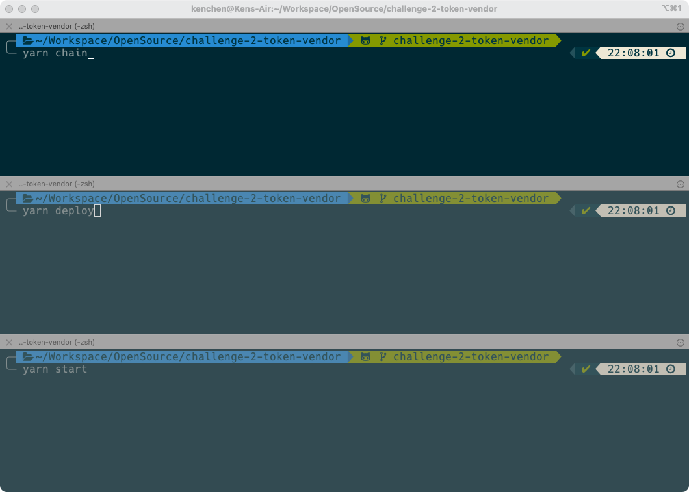

    命令执行后

    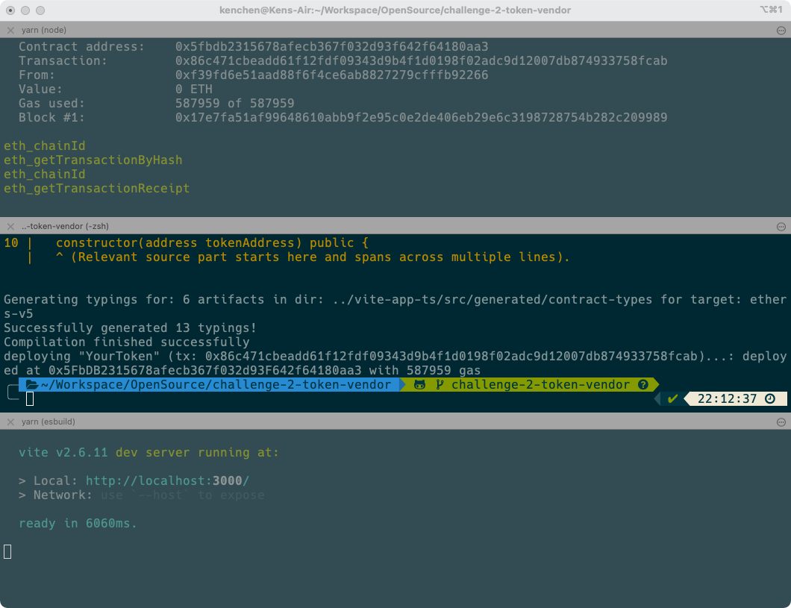

4. 前端页面

    在浏览器中访问 [`http://localhost:3000`](http://localhost:3000/) 可看到 App 的页面：

    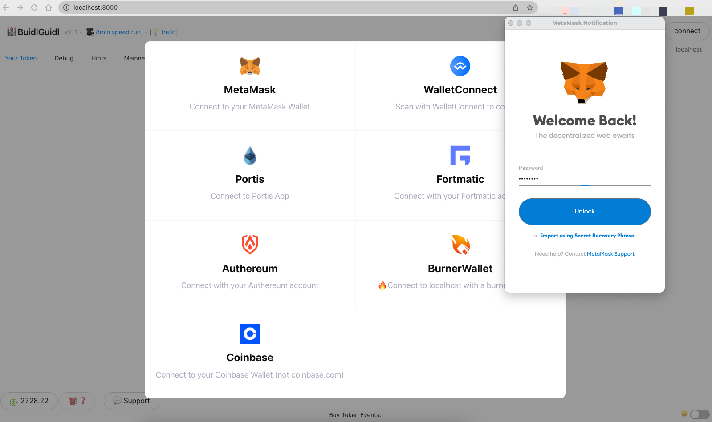

-------------
## 准备 MetaMask 及帐号

1. 如果你没有 Ethereum 的钱包帐号，可以通过 `yarn generate` 来生成一个：

    

2. 运行 `yarn account` 查看帐号信息：

    

    修改 `packages/hardhat-ts/hardhat.config.ts` 文件中关于 `DEBUG` 的语句为：`const DEBUG = true;`，查看帐号信息的时候还会显示出钱包的私钥，可以此导入帐号到 MetaMask。

3. 配置 MetaMask 网络

    如果你没有 MetaMask 本地网络，请配置如下：

      - 网络名称： `Localhost 8545`
      - 新增 RPC URL： `http://localhost:8545`
      - 链 ID： **`31337`**
      - Currency Symbol： `ETH`

    记得检查链 ID 的值。一般情况下它是 `1337`。但是 hardhat 的本地网络比较特殊，是 `31337`。如果你不改过来，会碰上[这个问题](https://hardhat.org/metamask-issue.html)，无法发出交易。

-------------
## 发布属于你的 Token

### Token 的智能合约

在 Ethereum 里的一个 Token 其实就是一个智能合约。我们需要定制化的合约文件位置是： `packages/hardhat-ts/contracts/YourToken.sol`。

```solidity
pragma solidity >=0.8.0 <0.9.0;
// SPDX-License-Identifier: MIT

// 继承于 OpenZeppelin 的 ERC20 Token 标准
import '@openzeppelin/contracts/token/ERC20/ERC20.sol';

// learn more: https://docs.openzeppelin.com/contracts/3.x/erc20

contract YourToken is ERC20 {
  // ToDo: add constructor and mint tokens for deployer,
  //       you can use the above import for ERC20.sol. Read the docs ^^^

  // 构造函数
  constructor() public ERC20('Gold', 'GLD') {
    // _mint() 1000 * 10 ** 18 to msg.sender
    _mint(msg.sender, 1000 * 10**18);
  }
}
```

通过继承 ERC20 的标准（`is ERC20`），这个 Token 就具备了基本的转账，查询账户持有 Token 的余额等基本功能。我们只需要为 Token 命名，和指定它的初始总量即可使用。

  - 代币符号： `GLD`
  - 代币名称： `Gold`
  - 初始总量： `1000 * 10**18` (1000 个 Token)

`10**18` 的意思是 10 的 18 次方，也就是有 18 个 0。为什么要用 `1000000000000000000` 这么大的一个数字才能表示一个 Token？原理和我们用**分**的单位来啊看**元**是一样的道理。EVM 和 Solidity 这门语言只能处理整数。为了方便 Token 能被切成小单元流通，我们需要一个更小的单位。而继承的 ERC20 里面定义了这个小数位的长度是 18。

### 部署，并转账 Token

合约编写完毕，更改 `packages/hardhat-ts/deploy/00_deploy_your_token.ts` 里面的这个语句，填入准备好的帐号，测试能否顺利转账：

```solidity
  // Todo: transfer tokens to frontend address
  const result = await yourToken.transfer(
    "0xC0802222dB0F31d63dc85d9C8CAa00485715A13c", ethers.utils.parseEther("1000"));
```

注意，如果我们要转 1000 个 Token，并不是直接传 1000 给 `transfer` 函数，而是需要经过 `ethers.utils.parseEther` 来转换成前面说到的真正给合约处理的数字。

修改完通过命令 `yarn deploy --reset` 即可部署。


部署成功后，通过浏览器的 `Debug` 页面，调用 `balanceOf` 函数，则可查看转账后的地址是否拥有相应数量的 Token。

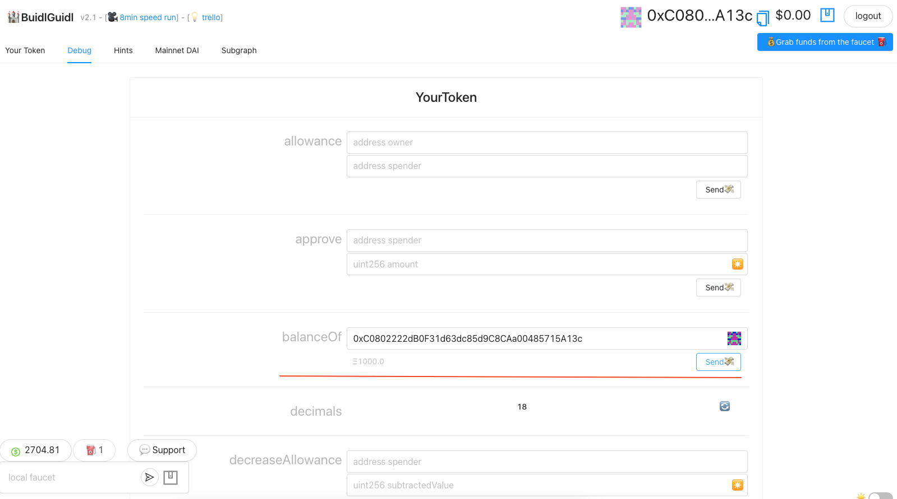

你还可以尝试从当前帐号转 Token 给另一个帐号。不过，在此之前，当前帐号的钱包需要具备一点 ETH。

当前页面的 **Grab funds from the faucet** 按钮可以马上获取一点。


另一个获取更多 ETH 的方法是通过 [faucet.paradigm.xyz](https://faucet.paradigm.xyz/) 页面授权 Twitter 登录后填地址索取。

通过 Debug 页面的 `transfer` 函数，我们可以转账 Token。这里要填写的数额也需要经过转换。当然，如果你算不过来那么多 0，也可以点 **Send** 按钮后在 MetaMask 弹出的确认框重新修改。

**注意**：因为合约的改动，或者时间的限制，你可能需要多次部署，不能一次测试完成。本地测试网络的变化，会导致帐号在网络中的交易数，和 MetaMask 上记录的交易数不同。发起交易时，MetaMask 可能会提醒你 **Nonce too high.  Expected nonce to be 0 but got x.** 这样的错误。如果是这样，你需要重新准备一个帐号，或者从 MetaMask 删除这个帐号，再重新导入试试。

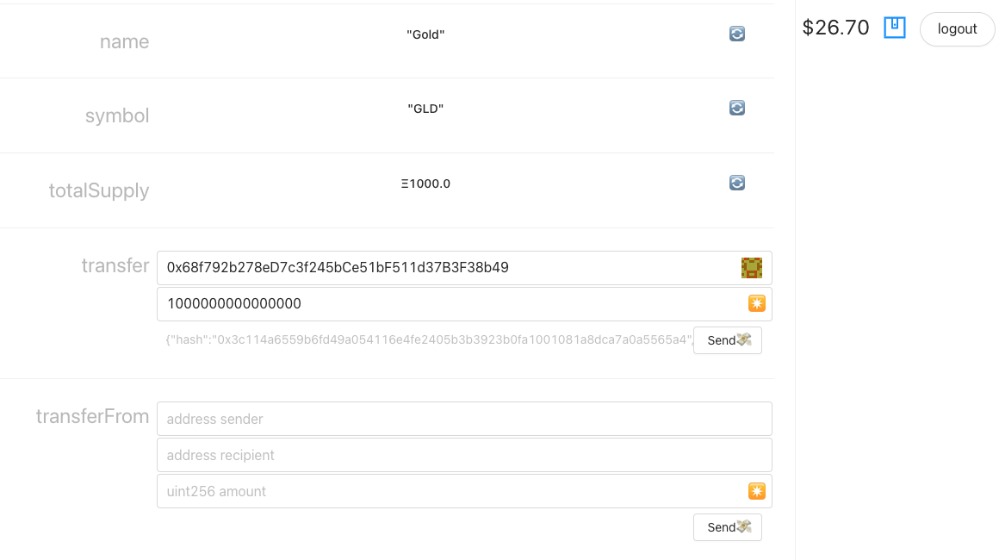

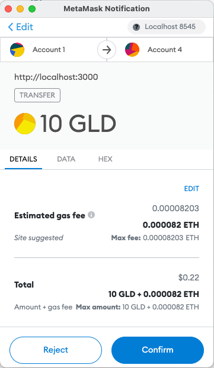

-------------
## 打造售卖机 Vendor

现在我们开始实现售卖机 Vendor 的智能合约了。它的框架在 `packages/hardhat-ts/contracts/Vendor.sol` 文件。

### 定义 Token 价格

既然要做 Token 的买卖，首先要定出它和 ETH 的汇率。

在合约中，我们通过 `tokensPerEth` 这个常量，可以定义一个 ETH 可以买多少个 Token。记得 1 个 Token 的意思是 1 * 10**18。由于测试帐号能拿到的免费 ETH 可能很少，所以这个数字不妨设大一些。

```solidity
uint256 public constant tokensPerEth = 10000;
```

### buyTokens 函数

买 Token 的函数逻辑很简单，就是根据交易的 ETH 数量，计算交易发送方能从售卖机处获得多少 Token。实现了 `buyTokens` 函数后的完整合约如下：

```solidity
pragma solidity >=0.8.0 <0.9.0;
// SPDX-License-Identifier: MIT

import '@openzeppelin/contracts/access/Ownable.sol';
import './YourToken.sol';

contract Vendor is Ownable {
  YourToken yourToken;

  uint256 public constant tokensPerEth = 10000;

  event BuyTokens(address buyer, uint256 amountOfEth, uint256 amountOfTokens);

  constructor(address tokenAddress) public {
    yourToken = YourToken(tokenAddress);
  }

  // ToDo: create a payable buyTokens() function:
  function buyTokens() public payable returns (uint256 tokenAmount) {
    require(msg.value > 0, 'ETH used to buy token must be greater than 0');

    uint256 tokenToBuy = msg.value * tokensPerEth;

    // check if the Vendor Contract has enough amount of tokens for the transaction
    uint256 vendorBalance = yourToken.balanceOf(address(this));
    require(vendorBalance >= tokenToBuy, 'Vendor has not enough tokens to sell');

    // Transfer token to the msg.sender
    bool success = yourToken.transfer(msg.sender, tokenToBuy);
    require(success, 'Failed to transfer token to user');

    emit BuyTokens(msg.sender, msg.value, tokenToBuy);

    return tokenToBuy;
  }
}
```

合约里的关键部分：

1. `payable` 修饰符：

    >表示这个函数可以接收 ETH。因为买 Token 就需要转 ETH 给 Vendor，所以需要标识该函数为 payable。

2. `require(msg.value > 0, 'ETH used to buy token must be greater than 0');` 语句：

    >约束条件的检查。很明显，要买 Token，传入的 ETH 数量必然要大于 0。`msg.value` 的值就是 ETH 的数量。

3. `address(this)` 函数调用：

    >获取本合约地址

4. `emit BuyTokens(msg.sender, msg.value, tokenToBuy)`：

    >触发 `BuyTokens` 事件，记录购买 Token 的地址，花费，和购买数量。事件可作为 EVM 的日志记录来使用。


### withdraw 函数

售卖机 Vendor 卖出 Token 后，买方的 ETH 就慢慢累积到 Vendor 这个帐号上了。那怎么把合约中的 ETH 取出来呢？这时我们需要实现这样一个 `withdraw` 函数：

```solidity
// ToDo: create a withdraw() function that lets the owner withdraw ETH
function withdraw() public onlyOwner {
  uint256 ethToWithdraw = address(this).balance;
  require(ethToWithdraw > 0, 'No ETH to withdraw');

  payable(msg.sender).transfer(ethToWithdraw);
}
```

合约里的关键部分：

1. `onlyOwner` 修饰符: 

    >表示这个函数只有合约拥有者（owner）才能调用。这个修饰符是从 `Ownable.sol` 合约继承过来的。

2. `payable(msg.sender).transfer(ethToWithdraw)` 语句: 

    >调用 `transfer` 函数，必须使用 payable address，而不是普通的 address。所以，需要用 `payable()` 转换，而不是像上一句那样用 `address()`。


### 部署 Vendor 合约

`withdraw` 函数已经准备好了，那谁才有资格从合约里面取款？当然是售卖机的拥有人，也就是 Vendor 合约的 owner 了。最初的 owner，就是部署合约的帐号。如果你在 App 连接的 MetaMask 帐号不是合约部署帐号，那就需要把所有权（ownership）转给 App 登录帐号。

把文件 `packages/hardhat-ts/deploy/01_deploy_vendor.ts` 这几行的注释解除，然后修改需要从 YourToken 转到 Vendor 的 Token 数量，最后如果有需要，指定 Vendor 合约的新 owner。

```solidity
// Todo: deploy the vendor

await deploy('Vendor', {
  // Learn more about args here: https://www.npmjs.com/package/hardhat-deploy#deploymentsdeploy
  from: deployer,
  args: [yourToken.address],
  log: true,
});

const vendor = await ethers.getContract("Vendor", deployer);

// Todo: transfer the tokens to the vendor
console.log("\n 🏵  Sending all 1000 tokens to the vendor...\n");

await yourToken.transfer(
  vendor.address,
  ethers.utils.parseEther("500") // 指定转到 Vendor 售卖机的 Token 数。
);

// 指定 Vendor 合约的新 owner
await vendor.transferOwnership("0xC0802222dB0F31d63dc85d9C8CAa00485715A13c");
```

**注意：**还需要把 `packages/hardhat-ts/deploy/00_deploy_your_token.ts` 里面转 Token 到自己帐号的语句注释掉，或者把值改成小，比如 500。

修改完毕，同样运行命令 `yarn deploy --reset` 重新部署合约。

下面是部署成功后的页面和操作截图：

售卖机初始有 500 个 Token，我打算买 10 个。

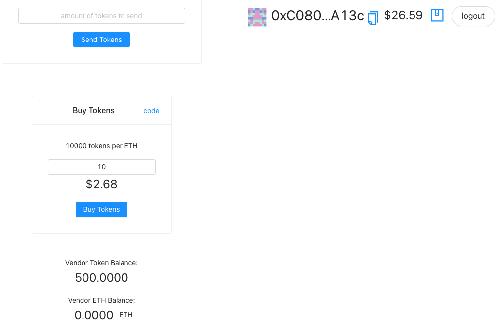

大概需要 0.001 个 ETH

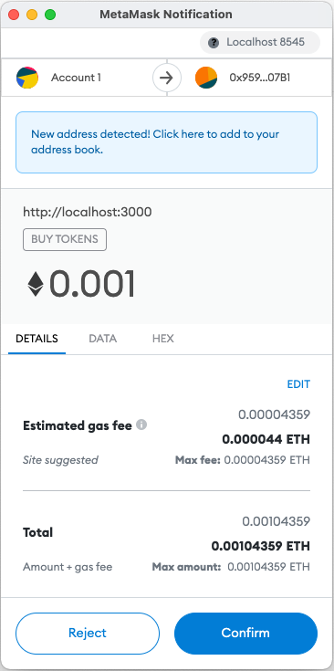

购买后 Vendor 剩下 490 个。ETH balance 也多了 0.001 ETH。下面还啊可以看到 Buy Token 的事件：

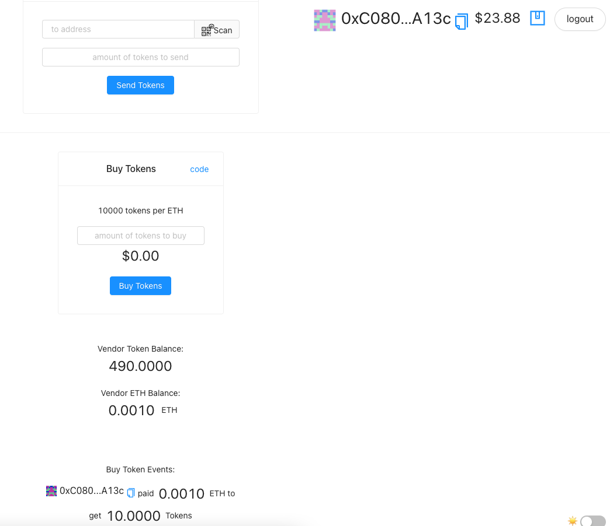

提取 ETH（当前帐号为 0.0089 ETH）

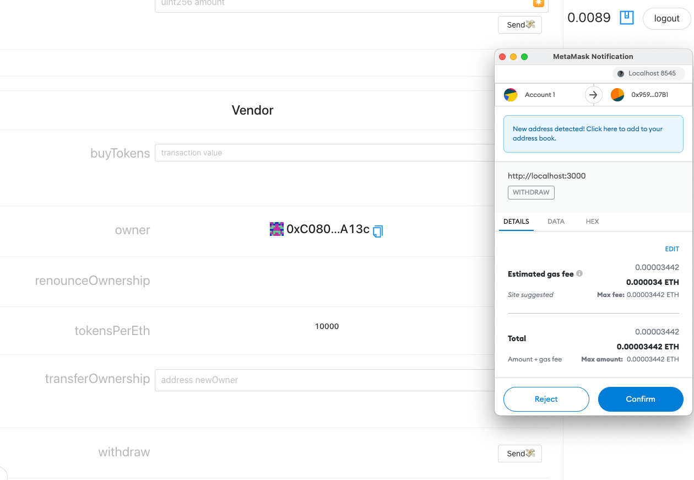

提取 ETH 成功（当前帐号则为 0.0098 ETH)

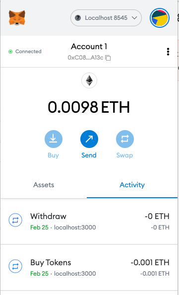

-------------
## 售卖机 Vendor 回购

有时候，我们想把手上的 Token 卖出去，换 ETH 回来。那如果售卖机 Vendor 能完成这样的操作就好了。

假如这个回购的流程是这样的：

1. Token 拥有者，拿出手上一定数量的 Token，调用 YourToken 的 `approve` 函数，属于 Vendor 合约的地址，以及 Token 的数量。意思是用户允许 Vendor 拿这个数量的 Token 来卖。

2. 然后，用户再调用 Vendor 合约里面新写的 `sellTokens` 函数，从 YourToken 那里获取经过允许的 Token 数量，再返还 ETH 到用户的帐号。

### YourToken 的 `approve` 函数

这个函数并不需要我们实现在 YourToken 合约里面，因为它继承于 `ERC20.sol`。（以下的代码并不需要复制到 YourToken 合约）

* `_approve` 这个内部函数是真正的逻辑主体部分。当用户调用这个方法时，`spender` 是 Vendor 合约的地址。

* 核心部分 `_allowances[owner][spender] = amount;` 负责在 YourToken 合约地址里面记录下用户允许 Vendor 获取的 Token 数量。

    ```solidity
     function approve(address spender, uint256 amount) public virtual override returns (bool) {
        address owner = _msgSender();
        _approve(owner, spender, amount);
        return true;
    }

    function _approve(
        address owner,
        address spender,
        uint256 amount
    ) internal virtual {
        require(owner != address(0), "ERC20: approve from the zero address");
        require(spender != address(0), "ERC20: approve to the zero address");

        _allowances[owner][spender] = amount;
        emit Approval(owner, spender, amount);
    }
    ```

### Vendor 的 `sellTokens` 函数：

把下面这段 `SoldTokens` 事件声明，和 `sellTokens` 函数复制到 Vendor.sol 里面：

    ```solidity
    // ToDo: create a sellTokens() function:
    event SoldTokens(uint256 amountOfEth, uint256 amountOfTokens);

    function sellTokens(uint256 tokenToSell) public {
      require(tokenToSell > 0, 'You need to sell at least some tokens');

      // 计算所需的 ETH 数量
      uint256 ethSold = tokenToSell / tokensPerEth;
      require(address(this).balance > ethSold, 'Not enough ETH to buy from Vendor');

      // 把 Token 从用户手上转到 Vendor 合约
      yourToken.transferFrom(msg.sender, address(this), tokenToSell);

      payable(msg.sender).transfer(ethSold);

      emit SoldTokens(ethSold, tokenToSell);
    }
    ```

有了前面 `buyTokens` 函数的经验，`sellTokens` 应该不难理解。不过它里面调用的 `yourToken.transferFrom` 函数，倒是可以看一下。 `transferFrom` 在 `ERC20.sol` 里的实现是这样的（以下部分不需要复制到 YourToken.sol 或者 Vendor.sol 里）：

    ```solidity
    function transferFrom(
        address from,
        address to,
        uint256 amount
    ) public virtual override returns (bool) {
        address spender = _msgSender();
        _spendAllowance(from, spender, amount);
        _transfer(from, to, amount);
        return true;
    }

    // 检查 owner 也就是 Vendor 合约是否能从 YourToken 获取 `msg.sender` 所需要数量的 Token。
    function _spendAllowance(
        address owner,
        address spender,
        uint256 amount
    ) internal virtual {
        uint256 currentAllowance = allowance(owner, spender);
        if (currentAllowance != type(uint256).max) {
            require(currentAllowance >= amount, "ERC20: insufficient allowance");
            unchecked {
                _approve(owner, spender, currentAllowance - amount);
            }
        }
    }

    function _transfer(
        address from,
        address to,
        uint256 amount
    ) internal virtual {
        require(from != address(0), "ERC20: transfer from the zero address");
        require(to != address(0), "ERC20: transfer to the zero address");

        _beforeTokenTransfer(from, to, amount);

        uint256 fromBalance = _balances[from];
        require(fromBalance >= amount, "ERC20: transfer amount exceeds balance");
        unchecked {
            _balances[from] = fromBalance - amount;
        }
        _balances[to] += amount;

        emit Transfer(from, to, amount);

        _afterTokenTransfer(from, to, amount);
    }
    ```

里面有一些关键点：

1. 用 `internal` 修饰符的函数就只能合约内部或继承者调用，外部没法使用。

2. `virtual` 修饰符表示该方法可被继承者重写。

3. ERC20 合约，其实是通过一个 `_balances` 的 mapping 类型变量，记录每一个账户地址拥有多少 Token。从一个账户转 Token 去另一个账户，就是操作 `_balances` 对应地址的值。

    我们来看一下 sellTokens 运作的页面是怎么样的。

    Approve Vendor 可售卖的 Token 数量：

    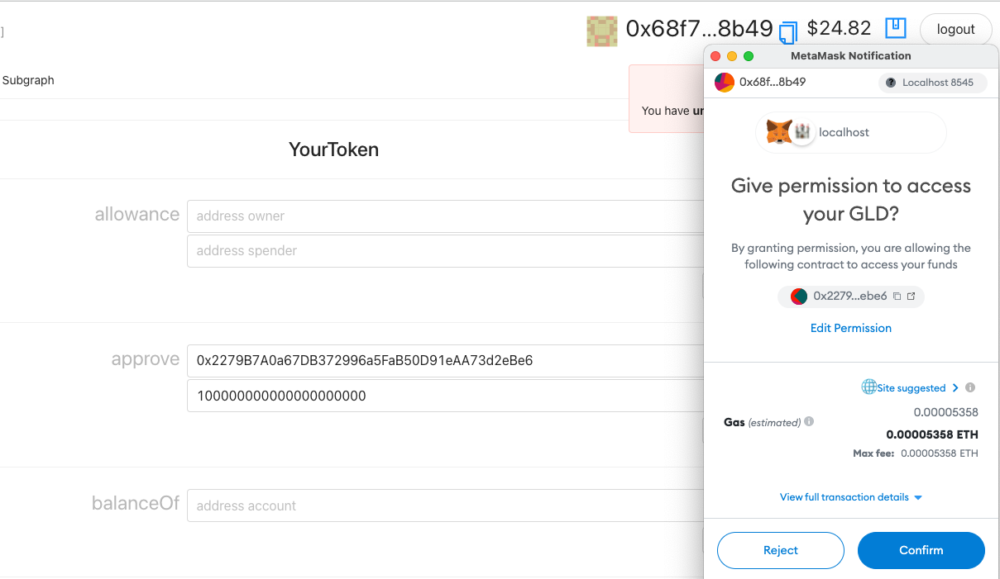

    售出 Token 给 Vendor 售卖机：

    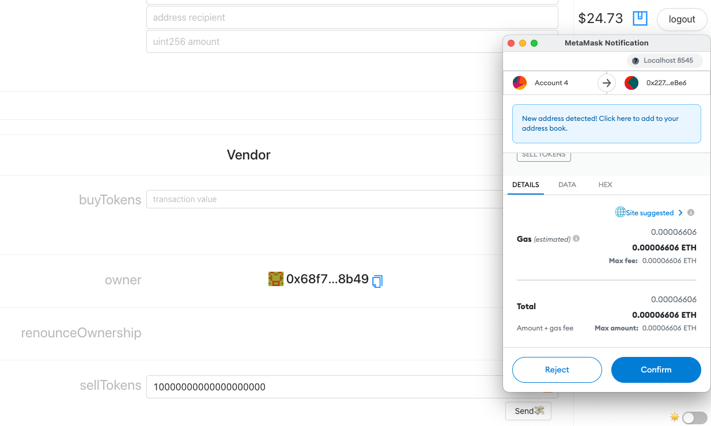

    提取 ETH 成功（当前帐号则为 0.0098 ETH)

    


## 公开部署

至此，`YourToken` 和 `Vendor` 自助售卖机合约所有的代码都已实现了，并在本地运行测试网络测试运行了。现在我们还可以通过修改以下两个文件的网络设置，直接部署合约到公共的测试网络，甚至主网。

文件 `packages/hardhat-ts/hardhat.config.ts`

```typescript
// const defaultNetwork = 'localhost';
const defaultNetwork = 'ropsten';
```

文件 `packages/vite-app-ts/src/config/providersConfig.ts`

```typescript
// export const targetNetworkInfo: TNetworkInfo = NETWORKS.local;
export const targetNetworkInfo: TNetworkInfo = NETWORKS.ropsten;
```

修改完上面两个文件，运行 `yarn deploy` 就能够部署到 Ropsten 测试网络了（需要你的帐号在 Ropsten 网络上有 ETH）。有可能，在你部署合约的时候，出现这个错误：

```bash
deploying "Vendor"replacement fee too low (error={"name":"ProviderError","code":-32000,"_isProviderError":true}
```

这好像是因为部署动作太快，导致交易发送太快，被拦下了。如果出现这个问题，可以把 `packages/hardhat-ts/deploy` 文件夹下面的两个部署文件，拿出文件夹，一个个放进去，分开来部署。

最后，运行 `yarn build` 和 `yarn surge` 命令就可以把整个前端页面打包并部署到 Surge 静态页面，让所有人公开访问了！
